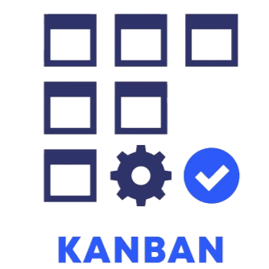
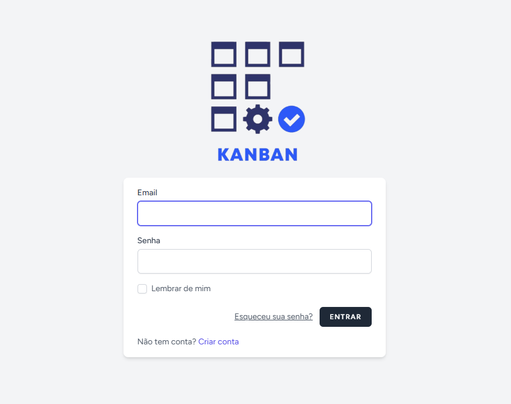
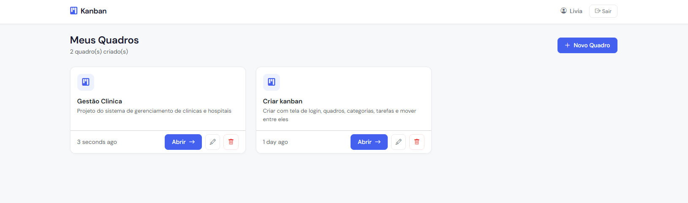
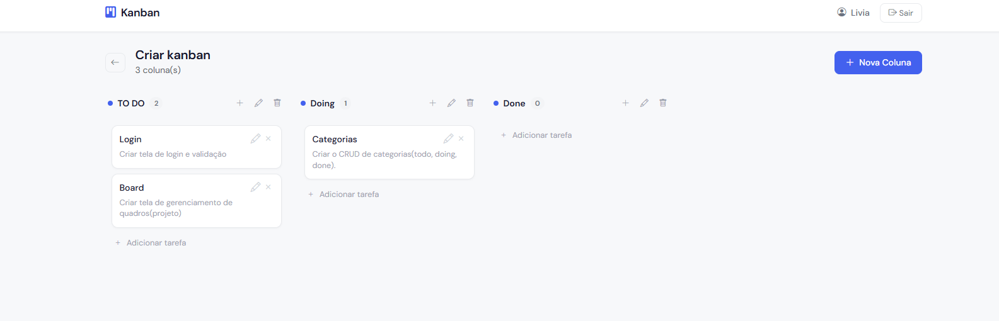

<h1 align="center">
    
    <br>
    Kanban App
</h1>

<p align="center">
  <a href="#-tecnologias">Tecnologias</a>&nbsp;&nbsp;&nbsp;|&nbsp;&nbsp;&nbsp;
  <a href="#-projeto">Projeto</a>&nbsp;&nbsp;&nbsp;|&nbsp;&nbsp;&nbsp;
  <a href="#-funcionalidades">Funcionalidades</a>&nbsp;&nbsp;&nbsp;|&nbsp;&nbsp;&nbsp;
  <a href="#-como-executar">Como executar</a>&nbsp;&nbsp;&nbsp;|&nbsp;&nbsp;&nbsp;
  <a href="#-estrutura">Estrutura</a>
</p>

<p align="center">
  
  
  
  
  
  
</p>

<br>

## 🚀 Tecnologias

Esse projeto foi desenvolvido com as seguintes tecnologias:

### Backend
- [Laravel 12](https://laravel.com/) — Framework PHP para o backend
- [PHP 8.5](https://www.php.net/) — Linguagem de programação
- [PostgreSQL](https://www.postgresql.org/) — Banco de dados relacional (hospedado no [Neon](https://neon.tech))
- [Laravel Breeze](https://laravel.com/docs/starter-kits#laravel-breeze) — Autenticação (login, registro, logout)
- [Spatie Laravel Permission](https://spatie.be/docs/laravel-permission) — Gerenciamento de roles e permissões
- [Eloquent ORM](https://laravel.com/docs/eloquent) — Mapeamento objeto-relacional

### Frontend
- [Bootstrap 5.3](https://getbootstrap.com/) — Framework CSS para interface responsiva
- [jQuery 3.7](https://jquery.com/) — Requisições AJAX dinâmicas
- [SortableJS](https://sortablejs.github.io/Sortable/) — Drag and drop das tarefas
- [Bootstrap Icons](https://icons.getbootstrap.com/) — Ícones da interface
- [Google Fonts (DM Sans)](https://fonts.google.com/specimen/DM+Sans) — Tipografia

---

## 💻 Projeto

O **Kanban App** é uma aplicação web de gerenciamento de tarefas no estilo Trello, desenvolvida como desafio técnico. Permite que usuários organizem suas tarefas em quadros, colunas e cards, com suporte a drag and drop para mover tarefas entre categorias.

---

## 🖥️ Screenshots
<p align="center">
  <a href=".github/images/login.png" target="_blank">
    
  </a>
  <a href=".github/images/boards.png" target="_blank">
    
  </a>
  <a href=".github/images/board.png" target="_blank">
    
  </a>
</p>

## ✨ Funcionalidades

- ✅ Autenticação completa (login, registro, logout)
- ✅ Sistema de roles com Spatie (`admin` e `user`)
- ✅ CRUD de Quadros (Boards)
- ✅ CRUD de Colunas (Categories)
- ✅ CRUD de Tarefas (Tasks)
- ✅ Drag and drop de tarefas entre colunas
- ✅ Ordenação persistida no banco de dados
- ✅ Operações dinâmicas via AJAX sem recarregar a página
- ✅ Interface responsiva com Bootstrap
- ✅ Indicador de loading nas ações
- ✅ Políticas de acesso (cada usuário acessa apenas os próprios boards)
- ✅ Admin pode visualizar e gerenciar todos os boards

---

## 🚀 Como executar

### Pré-requisitos
- PHP 8.2+
- Composer
- Node.js e NPM
- PostgreSQL (ou conta no [Neon](https://neon.tech))

### Instalação

```bash
# Clone o repositório
git clone https://github.com/lucasbars/kanban-app.git
cd kanban-app

# Instale as dependências PHP
composer install

# Instale as dependências JS
npm install && npm run build

# Copie o arquivo de ambiente
cp .env.example .env

# Gere a chave da aplicação
php artisan key:generate
```

### Configuração do banco de dados

No arquivo `.env`, configure sua conexão com o PostgreSQL:

```env
DB_CONNECTION=pgsql
DB_HOST=seu-host.neon.tech
DB_PORT=5432
DB_DATABASE=neondb
DB_USERNAME=seu_usuario
DB_PASSWORD=sua_senha
```

> ⚠️ Se estiver usando o Neon, utilize a **conexão direta** (sem pooler) para as migrations.

### Migrations e Seeders

```bash
# Rode as migrations
php artisan migrate

# Rode o seeder de roles (admin e user)
php artisan db:seed --class=RoleSeeder
```

### Executar o servidor

```bash
php artisan serve
```

Acesse em `http://127.0.0.1:8000`

### Criar um usuário admin

```bash
php artisan tinker
```

```php
$user = App\Models\User::where('email', 'seu@email.com')->first();
$user->assignRole('admin');
```

---

## 📁 Estrutura

```
kanban-app/
├── app/
│   ├── Http/Controllers/
│   │   ├── BoardController.php
│   │   ├── ColumnController.php
│   │   └── TaskController.php
│   ├── Models/
│   │   ├── Board.php
│   │   ├── Column.php
│   │   ├── Task.php
│   │   └── User.php
│   └── Policies/
│       └── BoardPolicy.php
├── database/
│   ├── migrations/
│   └── seeders/
│       └── RoleSeeder.php
├── public/
│   ├── css/
│   │   └── app.css
│   └── js/
│       ├── boards.js
│       └── kanban.js
└── resources/
    └── views/
        ├── boards/
        │   ├── index.blade.php
        │   └── show.blade.php
        ├── layouts/
        │   ├── app.blade.php
        │   └── guest.blade.php
        └── auth/
            ├── login.blade.php
            └── register.blade.php
```

---

## 🗄️ Banco de Dados

```
users
  └── boards (user_id)
        └── columns (board_id)
              └── tasks (column_id)
```

| Tabela | Campos principais |
|--------|-----------------|
| users | name, email, password |
| boards | name, description, user_id |
| columns | name, order, board_id |
| tasks | title, description, order, column_id |

---

## 🔐 Permissões

| Role | Permissões |
|------|-----------|
| `admin` | Ver e gerenciar todos os boards |
| `user` | Gerenciar apenas os próprios boards |

---

## 📝 Licença

Esse projeto está sob a licença MIT. Veja o arquivo [LICENSE](LICENSE.md) para mais detalhes.

---

#### Desenvolvido por Lucas Barbosa 💜